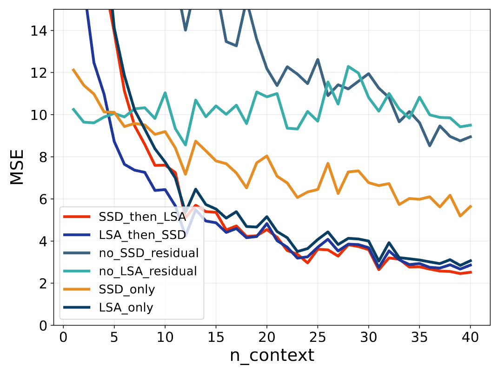
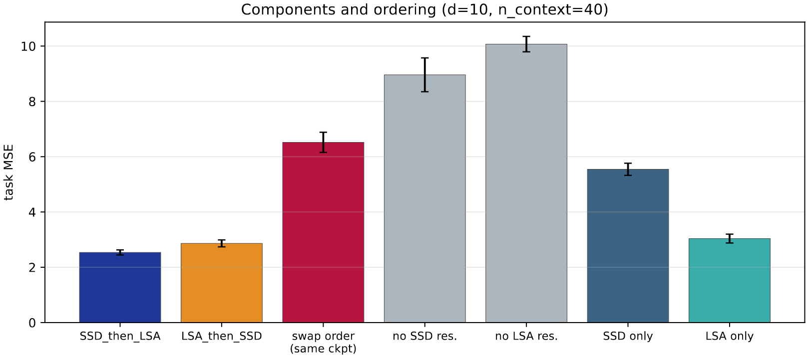
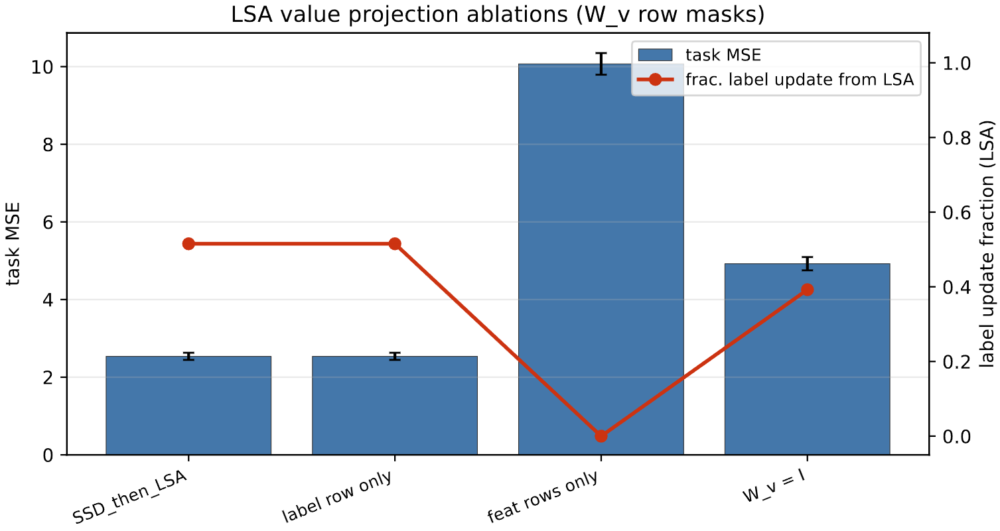
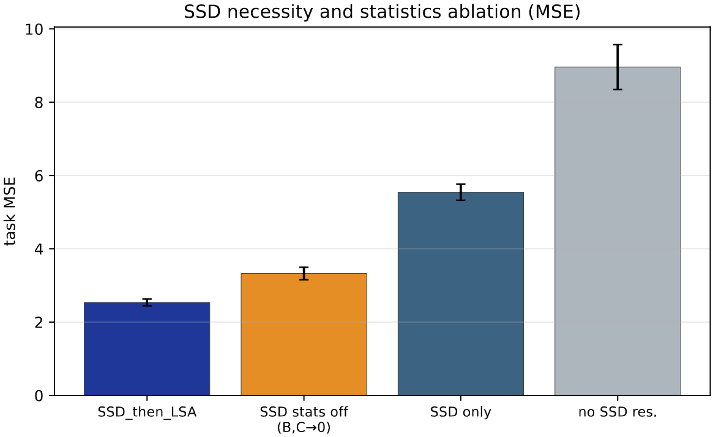
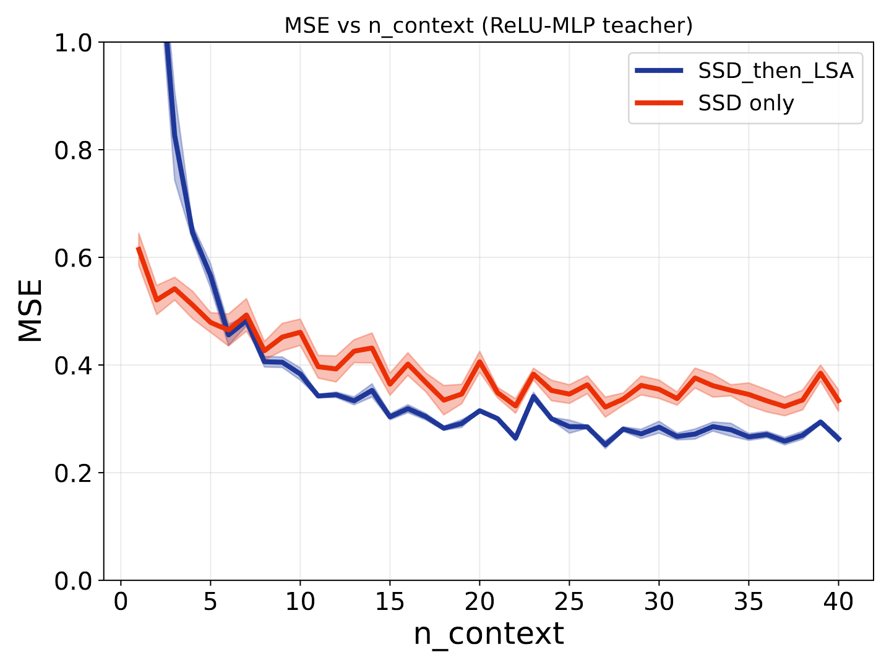
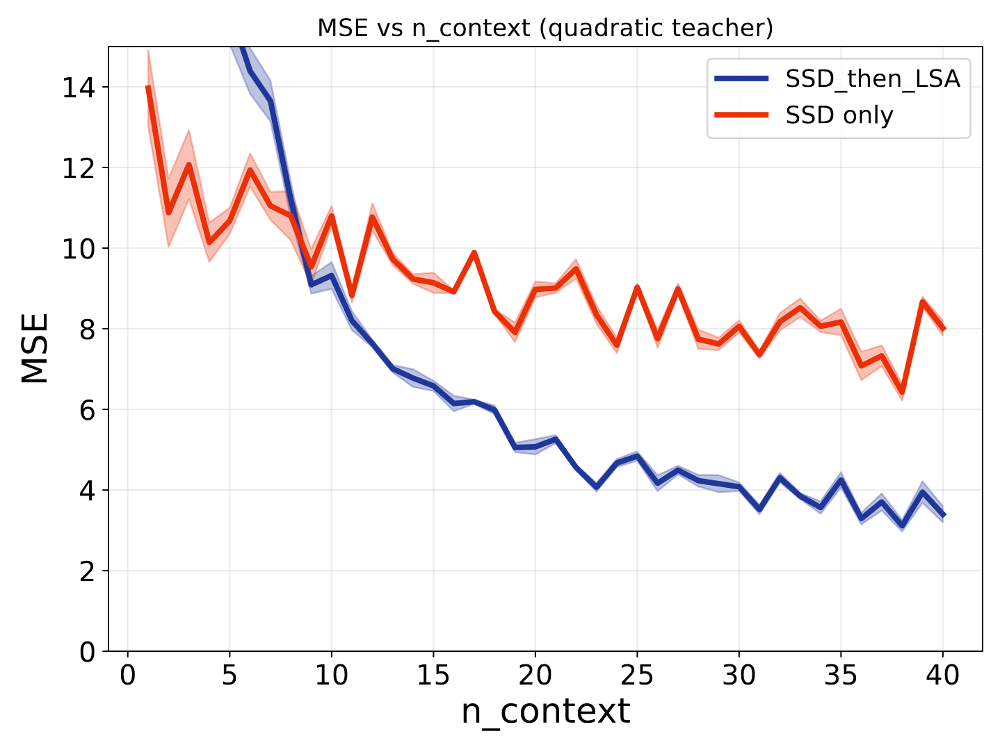
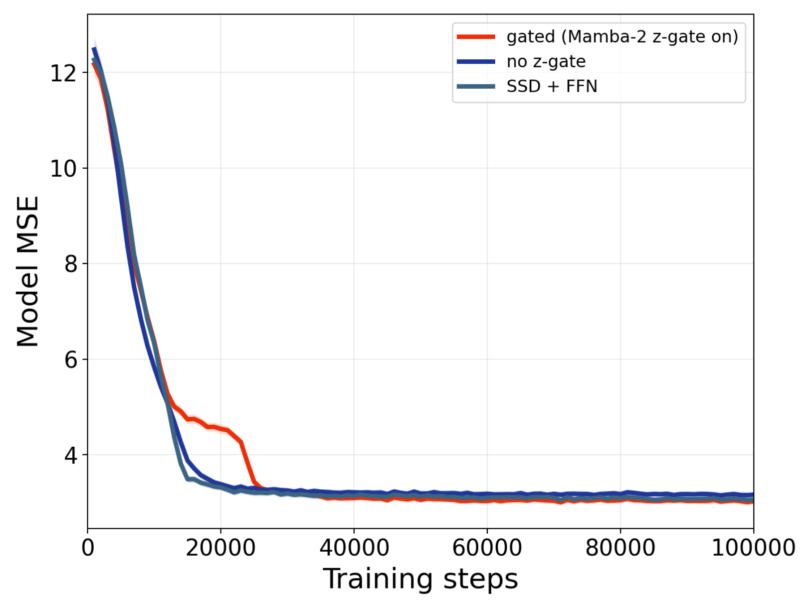
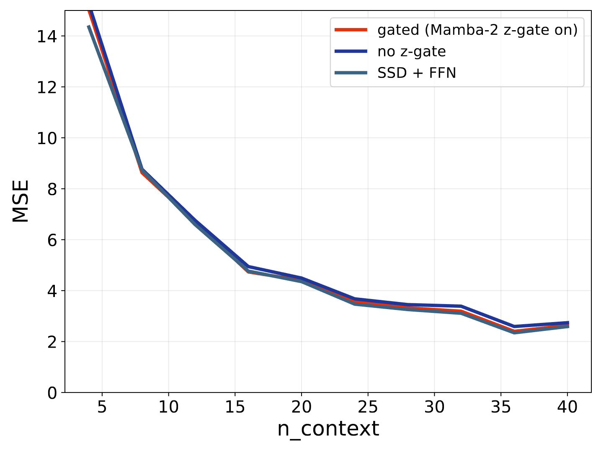

## Additional Experiments (SSD includes gating and nonlinear activation)

### Fig1: Inference time ICL performance

### Fig2: Task MSE ablation

### Fig3: LSA ablation

### Fig4: SSD ablation 

### Fig5: Nonlinear ICL

  
  

### Fig6: SSD gate and MLP ablation

  
  

